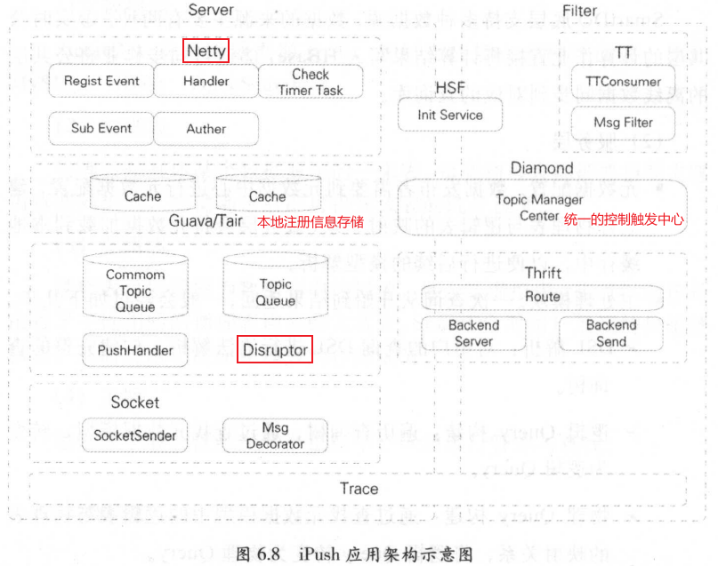
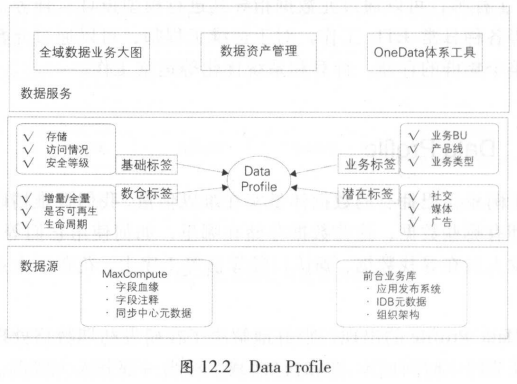

# 第 1 篇	数据技术篇

如何建设高效的数据模型和体系，使数据易用，避免重复建设和数据不一致性，保证数据的规范性？

如何提供高效易用的数据开发工具？

如何做好数据质量保障？

如何有效管理和控制日益增长的存储和计算消耗？

如何保证数据服务的稳定，保证其性能？

如何设计有效的数据产品高效赋能于外部客户和内部员工？

> 数据采集层：完成海量数据的采集，并将其传输到大数据平台

Aplus.JS Web 端日志采集技术方案

UserTrack App 端日志采集技术方案

埋点规范

通用浏览、点击、特殊交互、App 事件、H5 和 Native 日志数据打通

数据传输体系

TimeTunnel 增量数据传输，日志数据传输，实时流式计算，时间窗口的批量计算

数据同步工具

> 数据计算层：

## 第 2 章	日志采集

阿里两大日志采集体系：基于浏览器【Web】；基于无限客户端【APP端】

Web 端：Aplus.JS

APP 端：UserTrack

### 2.1 浏览器的页面日志采集

浏览器页面型产品/服务的日志采集分为两类：

1. 页面浏览（展现）日志采集
2. 页面交互日志采集

#### 2.1.1 页面浏览日志采集流程

基本指标：网页浏览量 PV, 访客数 UV

采集目标：页面被浏览器加载展现的记录

1. 用户在浏览器点击链接
2. 浏览器向服务器发起 HTTP 请求
3. 服务器接收并解析请求
4. 浏览器接受服务器的响应内容

【2017】阿里页面浏览器采集方案的流程框架

1. 客户端日志**采集**

   服务器端业务模块响应用户请求，构造用户请求文档

   服务器端采集代码部署模块改写文档，在 HTML 内插入日志采集代码

   

2. 客户端日志**发送**

   浏览器执行日志采集代码，向日志服务器发送日志请求

   

3. 服务器端日志**收集**

   日志存储供后续使用

   

4. 服务器日志**解析**存档

   日志解析、预处理

#### 2.1.2 页面交互日志采集

> 互动行为特征：

- 鼠标/输入焦点的移动变化【用户关注内容的变化】
- 对某些页面交互的反应【判断用户是否对某些页面元素发生认知困难】

特点：不触发浏览器加载新页面，无法通过 PV 【2.1.1 page view】日志采集方法收集

如何将**交互日志**发送到**日志服务器**？

> 策略：黄金令牌

1. 业务方在"黄金令牌"注册采集元数据，得到 交互日志采集代码模板
2. 业务方将代码植入目标页面，绑定代码和待检测交互行为
3. 用户页面产生指定行为，采集代码和响应代码被触发和执行
4. 将采集到的日志通过 HTTP 协议发送到 日志服务器

#### 2.1.3 页面日志的服务器端清洗和预处理

> 应用场合：失效要求较宽松

1. 识别流量攻击、网络爬虫和流量作弊
2. 数据缺项补正
3. 无效数据剔除
4. 日志隔离分发

### 2.2 无线客户端的日志采集

**采集 SDK** 【UserTrack】

将用户行为分成不同的事件：页面事件【页面浏览日志采集】，控件点击事件【页面交互日志采集】

#### 2.2.1 页面事件

页面事件：页面浏览行为

页面事件日志记录的三类信息：

1. 设备及用户的基本信息
2. 被访问页面的信息【商品详情页的商品 ID, 所属的店铺】
3. 访问基本路径【页面来源】

> 埋点：即用来采集数据的代码，在需要检测用户行为数据的地方加上一段代码

页面事件采集的三个接口方法：

1. 页面展现的接口：记录页面进入时的一些状态信息
2. 页面退出的接口：发送日志
3. 添加页面扩展信息的接口：给页面添加相关参数【店铺详情页添加店铺 ID, 店铺类别】

思考：在页面离开时发送日志的优势？

1. 记录页面停留时长
2. 可能存在大量用户同时进入页面的情况，但离开页面的时间点是随机的，可以起到错峰的作用

3. 。。。

> SPM Super Position Model 超级位置模型

作用：使用 SPM 并通过透传机制将搜索关键词等用户信息带入到相关联的浏览页面，实现用户行为路径还原

#### 2.2.2 控件点击及其他事件

控件点击及其他事件：App 端日志采集的交互类日志采集

其他事件：自定义事件以采集相关信息

UserTrace 提供的自定义埋点类包括：

1. 事件名称
2. 事件时长
3. 事件所携带的属性
4. 事件对应的页面

#### 2.2.3 特殊场景

日志聚合：滚屏浏览时商品会多次曝光产生上百条日志。通过 SDK 聚合功能，将曝光的内容而非曝光事件传递给日志服务器

回退行为：用户在 App 的多个页面间切换时的路径来源问题。利用页面的生命周期，识别页面的复用，配合栈的深度来识别是否是回退行为

#### 2.2.4 H5&Native 日志统一

APP 页面采集方式：

- Native 页面：采集 SDK 
- H5 页面：**浏览器**的页面采集方式

> 实现 Native 和 H5 日志统一处理？

将 H5 日志归到 Native 日志，采集 SDK 处理日志

原因：

1. 采集 SDK 可采集到设备相关的数据，用于移动端数据分析
2. 采集 SDK 可以借助本地缓存在网络状况不佳时保存数据延迟上报

归并流程：

1. 在页面开发时手动植入日志采集的 JavaScript 脚本，采集 H5 页面浏览和页面交互的数据
2. 脚本将采集数据打包到对象中【埋点数据对象】，并将其作为参数传入 WebView 框架的 JSBridge 接口方法
3. App 日志采集 SDK ，封装 2 中提供的接口【事件类别扩展】，实现将传入的内容转换程 App 端日志格式

#### 2.2.5 设备标识

互联网产品的两大基本指标：

- 页面浏览量 Page View 
- 访客数 Unique Visitors

问题：如何收集不需要用户登录【获取用户 ID 以统计 UV】的日志行为? 换言之，如何根据没有用户 ID 的日志统计 UV？

使用设备信息来进行唯一标识

- PC 端：使用 Cookie 作为设备的唯一信息
- APP 端：UTDID

#### 2.2.6 日志传输

APP 端日志的上传，压缩及传输的特殊性

上传：先存储在客户端，再伺机上传

压缩：例如适当释放其他类型日志的资源来处理更重要的页面事件及控件点击事件

传输：使用消息队列暂存从日志采集服务器上收集到的消息，以供其他应用定时获取消息，并进行相关处理

### 2.3 日志采集的挑战

日志数据的结构化和规范化组织

实现更为高效的下游统计计算

提供符合业务特性的数据展现

为算法提供更为敏捷，灵活的支持

#### 2.3.1 典型场景

> 两个典型场景的解决方案：

- 日志分流与定制处理：分治策略 + 布置路由
- 采集与计算一体化设计：规范定制-元数据注册-日志采集-自动化计算

#### 2.3.2 大促保障

全链路：端上埋点采集——日志服务器收集——数据传输——日志实时解析——实时分析

服务器收集能力：峰值 QPS

数据传输能力：TT 搬运速度

实时解析的吞吐量

实时业务分析处理能力

2023年1月3日周二 21：50，耗时 2.5 小时

## 第 3 章	数据同步

数据采集：日志采集，数据库数据同步

数据同步技术：不同系统间的数据流转

应用场景：

- 主数据库与备份数据库之间的数据备份
- 主系统与子系统间的数据更新
- 同类型不同集群数据库之间的数据同步
- 不同地域、不同数据库类型间的数据传输交换
- 分布式业务系统与数据仓库系统间的数据同步

### 3.1 数据同步基础

数据来源：

- 关系型数据库：MySQL，Oracle，DB2，SQL Server
- 非关系型数据库：OceanBase, HBase, MongoDB
- 文件系统：阿里云对象存储 OSS，文件存储 NAS

同步方式：

- 直连同步
- 数据文件同步
- 数据库日志解析同步

#### 3.1.1 直连同步

直连同步：通过定义好的规范接口 API 和基于动态链接库的方式直接连接业务库

适用场景：操作型业务系统的数据同步

特点：当数据量较大时，此种抽取方式性能较差

#### 3.1.2 数据文件同步

数据文件同步：通过约定好的文件编码，大小，格式等，直接从源系统生成数据的文本文件，由专门的文件服务器传输到目标系统后，加载到目标数据库系统中

优点：由于会先转存程数据文件，可适用于数据源包含多个异构数据库系统时的场景

#### 3.1.3 数据库日志解析同步

优点：实现实时与准实时同步能力，延迟可控制在毫秒级别，对业务系统性能影响较小

场景：用于从业务系统到数据仓库系统的增量数据同步应用中

问题：

- 数据延迟：批量补录造成更新量超出系统处理峰值
- 投入较大：需在源/目标数据库间部署一个系统实时抽取数据
- 数据漂移和遗漏：增量表的同一个业务日期数据中包含前一天或后一天凌晨附件的数据或丢失当天的变更数据

### 3.2 阿里数据仓库的同步方式

数据仓库：将不同的数据来源，不同形式的数据整合在一起

阿里数据仓库的特点：

- 数据来源多样性：
- 数据量：阿里大数据处理系统 MaxCompute 数据存储达到 EB 级别

#### 3.2.1 批量数据同步

DataX : 通过插件形式提供支持，将数据从数据源读出并转换为中间状态，同时维护好数据的传输、缓存池等工作

#### 3.2.2 实时数据同步

日志类数据：

双 11 数据大屏：解析 MySQL 的 binlog 日志获取增量的数据更新，通过消息订阅模式实现数据的实时同步

### 3.3 数据同步遇到的问题与解决方案

#### 3.3.1 分库分表的处理

分库分表：解决系统的扩展能力和高并发大数据量的处理能力

TDDL (Taobao Distributed Data Layer) 分布式数据库访问引擎，通过建立中间状态的逻辑表来整合统一分库分表访问

功能：实现数据库配置信息的统一管理

- SQL 解析
- 规则计算
- 表名替换
- 选择执行单元
- 合并结果集
- 数据库表的读写分离
- 高性能主备切换

#### 3.3.2 高效同步和批量同步

数据同步方法：先创建目标表，再通过同步工具的填写数据库连接、表、字段等各种配置信息后测试完成数据同步

OneClick ：实现数据的一键化和批量化同步，一键完成 DDL 和 DML 的生成，数据的冒烟测试以及在生产环境中测试等

#### 3.3.3 增量与全量同步的合并

背景：淘宝交易订单表，每天新增，变更的增量数据多达几亿条

方案：同步当天的增量数据，并与数据仓库中的前一天全量数据合并，获得截至当天的最新全量数据

即：全连接 full outer join  + 数据全量覆盖重新加载

#### 3.3.4 同步性能的处理

数据同步任务：针对不同数据库系统之间的数据同步问题而创建的一系列周期调度的任务

方案：设定首轮同步的线程数，然后运行同步任务

问题：

- 数据同步任务的总线程数 < 用户设置的首轮同步线程数：导致数据同步速度非常慢
- 用户不清楚如何设置首轮同步线程数：导致同步任务得不到合理的 CPU 资源而影响同步效率
- 同步控制器分类对待不同重要程度的数据同步任务：导致重要的同步线程得不到 CPU 资源而无法同步

解决方案：

- 通过目标数据库元数据估算同步任务的总线程数
- 通过系统预先定义的期望同步速度估算首轮同步的线程数
- 通过数据同步任务的业务优先级决定同步线程的优先级

#### 3.3.5 数据漂移的处理

ODS / staging 层数据：从源系统同步进入数据仓库的第一层数据

数据漂移：ODS 表的同一个业务日期数据中包含前一天或后一天凌晨附件的数据或丢失当天的变更数据

问题：ODS 表按时间段切分进行分区存储，而由于时间戳字段的准确性问题导致发生数据漂移

时间戳字段分类：

- modified_time ：**数据库表**中标识数据记录更新时间的时间戳字段
- log_time ：**数据库日志**中标识数据记录更新时间的时间戳字段
- proc_time ：**数据库表**中记录具体业务过程发生时间的时间戳字段
- extract_time ：标识数据记录被抽取到时间的时间戳字段

处理方案：

1. 多获取后一天的数据
2. 通过多个时间戳字段限制时间来获取相对准确的数据

2023年1月4日23：44 耗时 2 H

## 第 4 章	离线数据开发

阿里数据计算层两大体系：

- 数据存储及计算平台
  - 离线计算平台：MaxCompute
  - 实时计算平台：StreamCompute
- 数据整合及管理体系：OneData

### 4.1 数据开发平台

统一计算平台：MaxCompute

统一开发平台：D2

#### 4.1.1 统一计算平台

MaxCompute ：提供数据上传/下载通道、SQL、MapReduce、机器学习算法、图编程模型和流式计算模型多种计算分析服务

MaxCompute 特点：

- 计算性能高且更加普惠
- 集群规模大且稳定性高
- 功能组件非常强大
  - MaxCompute SQL
  - MaxCompute MapReduce
  - MaxCompute Graph：图计算处理框架
  - Spark：处理数据
  - RMaxCompute：使用 R 处理数据
  - Volume：管理非二维表数据
- 安全性高：多租户数据安全体系

#### 4.1.2 统一开发平台 D2

开发工作流图：

D2 : 集成任务开发，调试及发布，生产任务调度及大数据运维，数据权限申请及管理等功能的一站式数据开发平台，承担数据分析工作台的功能

**1. 在云端 D2**

**2. SQLSCAN**

SQLSCAN 三类规则校验：

- 代码规范类规则：表明名，生命周期设置，表注释
- 代码质量类规则：NULL 值参与计算，插入字段顺序错误
- 代码性能类规则：分区裁剪失效，扫描大表提醒，重复计算检测

**3.DQC**

DQC (Data Quality Center 数据质量中心) 在数据处理任务过程中进行数据质量方面的监控

两大功能：

- 数据监控：监控数据质量并报警
- 数据清洗：清洗不符合既定规则的数据，不会触发报警

**4.在彼岸**

数据测试：

- 典型方法：功能测试
- 场景
  - 新增业务需求
  - 数据迁移，重构和修改

在彼岸：用于解决测试问题开发的大数据系统的**自动化测试平台**，将通用的，重复性的操作沉淀在测试平台中

在彼岸组件：

- 数据对比：支持不同集群，异构数据库的表做数据对比
- 数据分布：提取表和字段的一些特征值，并将特征值与预期值进行比对

- 数据脱敏：将敏感数据模糊化

### 4.2 任务调度系统

#### 4.2.1 背景

调度任务关系依赖图：

传统数据仓库系统：依靠 Crontab 定时任务功能进行任务调度处理

- 各任务间的依赖基于执行时间实现，造成前面任务未结束或失败而后面任务已运行
- 任务难以并发执行
- 无法设置任务优先级
- 任务管理维护不方面，无法进行执行效果分析

#### 4.2.2 介绍

##### 1. 数据开发流程与调度系统关系

##### 2. 调度系统的核心设计模型

核心模块：

- 调度引擎 Phoenix Engine ：根据任务节点属性以及依赖关系进行实例化，生成各类参数的实值，并生成调度树
- 执行引擎 Alisa ：根据调度引擎生成的具体任务实例和配置信息，分配 CPU、内存，运行节点等资源，在任务对应的执行环境中运行节点代码

##### 3. 任务状态机模型

任务状态机模型：针对数据任务节点在整个运行生命周期的状态定义

##### 4. 工作流状态机模型

工作流状态机模型：针对数据任务节点在调度树中生成的工作流运行的不同状态定义

##### 5. 调度引擎工作原理

调度引擎：基于 **任务状态机模型** 和 **工作流状态机模型**，生成 任务节点实例

##### 6. 执行引擎发工作原理

##### 7. 执行引擎的用法

Alisa 用户系统包括：上下文的工作流服务，数据同步服务，调度引擎生成的各类数据处理任务的调度服务

MaxCompute task：任务被提交到 MaxCompute 集群中，Alisa 仅运行 MaxCompute 的 Client

StreamCompute task：任务被提交到对应的目标系统中运行

Shell task ，DataX task, TT task ：直接运行在 Alisa 集群上

#### 4.2.3 特点及应用

调度系统的特点和应用场景：

- 调度配置：输入输出配置 + 自动识别
- 定时调度：设定任务运行时间：分，时，日，周，月，秒
- 周期调度：可按小时，日等时间周期运行任务

- 手动运行：在 IDE 中写好脚本发布到生产环境，再手动触发运行
- 补数据：设定需要补道德时间区间，并圈定需要运行的任务节点
- 基线管理：按优先级分类管理的方法
- 监控报警：设置电话，短信，邮件等不同的告警方式

2023年1月5日16：42 耗时 2.5 h

## 第 5 章	实时技术

阿里实时技术背景：面向媒体的数据大屏，面向商家端的数据大屏、面向阿里内部业务运营的数据大屏。大屏直播需要实时处理的数据量达亿级别。

阿里实时处理要求：高精度，高吞吐量，低延时，强保障

### 5.1 简介

流计算技术举例：实时统计广告位的曝光和点击等指标作为运营决策的参考

数据时效性分类：

- 离线：延迟时间粒度为天
- 准实时：延迟时间粒度为小时
- 实时：延迟时间粒度为秒

处理方式：

- 离线和准实时：批处理系统，Hadoop, MaxCompute, Spark 等系统
- 实时：流式处理系统

流式数据处理技术：业务系统每产生一条数据，就立刻被采集并实时发送到流式任务中进行处理

流式数据处理的特征：

- 时效性高：延时粒度在秒级甚至毫秒级
- 常驻任务：一旦启动后会一直运行，直到人为终止

- 性能要求高：例如处理吞吐量需要跟上采集吞吐量

- 应用局限性：不能替代离线处理，对于业务逻辑复杂的场景支持不足

### 5.2 流式技术架构

流式计算技术对的子系统按功能划分，主要分为：

- 数据采集：来源于各个业务的日志服务器，被实时采集到数据中间件中
- 数据处理：流计算引擎支持流式任务执行
- 数据存储：数据被实时加工后，增量写到某在线服务的存储系统中
- 数据服务：在存储系统之上，用于获取实时计算结果

#### 5.2.1 数据采集

数据采集种类：

- 数据库变更日志：如 MySQL 的 binlog 日志、HBase 的 hlog 日志
- 引擎访问日志：如 用户访问网站产生的 Apache 引擎日志

按批次进行数据采集的原则：

- 数据大小限制：
- 时间阈值限制：

消息系统与数据中间件：

- 消息系统：用作业务**数据变更**的消息中转，如订单下单，支付等消息
- 数据中间件：用于较大的业务数据（每日几十TB的容量）

消息系统|数据中间件|数据库

使用建议：一般通过数据中间件来采集数据库变更数据来获取实时数据

#### 5.2.2 数据处理

开源流计算引擎系统：

- Twitter : Storm 系统
- 雅虎：S4 系统
- Apache ：Spark Streaming, Flink
- 阿里云：StreamCompute

实时任务典型问题：

- 去重指标：计算逻辑和中间结果数据都在内存中

  - 精确去重：保存明细数据，遇到内存问题时，通过数据倾斜把节点内存压力分摊到多个节点
  - 模糊去重：去重明细数据量非常大，业务精度要求不高时

  去重方法：

  - 布隆过滤器：保存明细数据对应哈希值的标记为，适用于统计精度要求不高，统计维度值非常多的情况，如统计全网各个商家的 UV 数据
  - 基数估计：按照数据的分散程度来估算现有数集的边界，适用于统计精度要求不高，统计维度非常粗的情况，如整个大盘的 UV 数据

- 数据倾斜：数据量非常大时，单节点处理会遇到性能瓶颈，需要对数据进行分桶处理
  - 去重指标分桶：对去重值进行分桶，相同的值被放入同一个桶中
  - 非去重指标分桶：数据随机分发到每个桶中，最后再把每个桶中的值汇总
- 事务处理：网络抖动导致数据发送不成功，及其重启导致数据丢失等，需要进行数据自动 ACK，失败重发以及事务信息等机制
  - 超时时间：数据处理超时时，从拓扑的 spout 端重发数据
  - 事务信息：每批数据会附带事物ID的信息，可据此进行重发时的不同处理逻辑
  - 备份机制：确保内存数据可通过外部存储恢复

#### 5.2.3 数据存储

数据存储中涉及的三种类型的数据：

- 中间计算结果：如去重指标的明细数据，用于故障时恢复内存现场
- 最终结果数据：通过 ETL 处理后的实时结果数据
- 维表数据：离线计算系统中，通过同步工具导入到在线存储系统，供实时任务来关联实时流数据

数据统计中表名设计和 rowkey 设计的一些实践经验：

1. 表名设计：汇总层标识 + 数据域 + 主维度 + 时间维度
2. rowkey 设计：MD5 + 主维度 + 维度标识 + 子维度 1 + 时间维度 + 子维度 2

#### 5.2.4 数据服务

OneService 优点：

- 不需要直连数据库，数据源等信息在数据服务层维护
- 调用方只需要使用服务层暴露的接口
- 屏蔽存储系统间的差异，统一的调用日志输出

### 5.3 流式数据模型

实时数据模型是离线数据模型的一个子集

#### 5.3.1 数据分层

ODS 层：操作数据层，是直接从业务系统采集过来的最原始数据，包含所有业务的变更过程

DWD 层：根据业务过程建模出来的实时事实明细层

DWS 层：实时通用汇总层，如电商数据的几大维度的汇总表

ADS 层：个性化维度汇总层，如淘宝下的某个爱逛街，微淘等垂直业务

DIM 层：维表层，如商品维表，卖家维表，买家维表，类目维表

#### 5.3.2 多流关联

实时明细表：流式计算中常常需要把两个实时流进行主键关联

流式计算中的表关联：数据到达时间不确定和无序，数据处理过程涉及中间状态的保存和恢复机制等

#### 5.3.3 维表使用

实时计算中，关联维表一般会使用当前的实时数据(T)去关联 T - 2 的维表数据，相当于在 T 的数据到达之前需要把维表数据准备好

原因：

1. 数据无法及时准备好：T - 1 的维表数据一般不能在零点马上准备就绪
2. 无法准确获取全量的最新数据：需要使用多流实时关联来实现
3. 数据的无序性：维表使用分两种形式
   1. 全量加载：维表数量较少，一次性加载到内存中，并直接和实时流数据进行关联
   2. 增量加载：维表数据很多，使用增量查找和 LRU 过期的形式，让最热门的数据留在内存中

### 5.4 大促挑战&保障

大促期间，各个业务系统面临的峰值会达到最高点

#### 5.4.1 大促特征

大促时峰值会特别明显，数据量是其他时间点的几倍甚至数十倍，对系统的抗压能力要求非常高

1. 毫秒级延时

2. 洪峰明显：大促前会进行多次全链路压测和预案梳理

3. 高保障性：

   

4. 公关特性：数据及时对公众披露

#### 5.4.2 大促保障

1. 如何进行实时任务优化

   1. 独占资源和共享资源的策略
   2. 合理选择缓存机制，尽量降低读写库次数
   3. 计算单元合并，降低拓扑层级
   4. 内存对象共享，避免字符拷贝
   5. 在高吞吐量和低延时间取平衡

2. 如何进行数据链路保障：多链路搭建，多机房容灾，异地容灾

   

   通过工具比对多条链路计算的结果数据，当某条链路出现问题时，会一键切换到备链路，并通过推送配置的形式让其秒级生效，所有的接口调用会立刻切换到备链路

3. 如何进行压测：数据压测和产品压测

   数据压测：蓄洪压测，把几个小时甚至几天的数据积累下来，并在某时刻全部放开，模拟"双11"洪峰流量的情况

   产品压测：产品本身压测和前端页面稳定性测试

   - 产品本身压测：收集大屏服务端的所有读操作的 URL，通过压测平台进行压测流量回放
   - 前端页面稳定性测试：将大屏页面在浏览器中打开，并进行 8~24 小时前端页面稳定性测试

## 第 6 章	数据服务

服务架构的每次升级，均在性能，稳定性，扩展性等方面有所提升

### 6.1 服务架构演进

#### 6.1.1 DWSOA

DWSOA ：数据服务的第一阶段，将业务方对数据的需求通过 SOA 服务的方式暴露出去

优点：实现简单

缺点：接口粒度较粗，灵活性不高，扩展性差，复用率低

#### 6.1.2 OpenAPI

OpenAPI ：数据服务的第二阶段，将数据按照统计粒度进行聚合，同样维度的数据，形成一张逻辑表，采用同样的接口描述

优点：OpenAPI 改进了 DWSOA 接口众多不好维护的问题，可以有效收敛接口数量

#### 6.1.3 SmartDQ

SmartDQ ：在 OpenAPI 基础上，再抽象一层，用 DSL (Domain Specific Language) 描述取数需求

DSL ：标准的 SQL 语法 + ORM (Object Relation Mapping) 解决对象关系映射问题

#### 6.1.4 统一的数据服务层

OneService ：提供多种服务类型满足用户需求(如：个性化垂直业务场景，实时数据推送服务，定时任务服务)

- OneService-SmartDQ：DSL 接口
- OneService-Lego：插件化方式开发服务，用于满足个性化取数业务场景
- OneService-iPush：提供 WebSocket 和 long polling 两种方式，用于商家端实时直播
- OneService-uTiming：提供即时任务和定时任务两种模式，用于满足用户运行大数据量任务

### 6.2 技术架构

#### 6.2.1 SmartDQ

**1.元数据模型**

**2.架构图**

#### 6.2.2 iPush

iPush ：面向 TT 、MetaQ 等不同消息源，通过定制过滤规则，向 Web、无线等终端推送消息的**中间件平台**

#### 6.2.3 Lego

Lego ：面向中度和高度定制化数据查询需求、支持插件机制的**服务容器**

#### 6.2.4 uTiming

uTiming ：基于在云端的任务调度应用，提供批量数据处理服务，支持用户识别、用户画像，人群圈选三类服务的离线计算，以及用户识别、用户画像、人群透视的服务数据预处理、入库

### 6.3 最佳实践

#### 6.3.1 性能

**1.资源分配**

1. 剥离计算资源：剥离复杂的计算统计逻辑，将其全部交由底层的数据公共层进行处理，只保留核心的业务处理逻辑

2. 查询资源分配：为 Get 和 List 请求分别设置独立的线程池，避免 List 慢查询影响 Get 快查询

3. 执行计划优化：

   1. 查询拆分：

   

   2. 查询优化：分析用户请求中的 SQL 语句，将符合条件的 List 查询转换为 Get 查询
      - 解析 WHERE 子句，提取出筛选字段以及筛选条件
      - 根据筛选条件和筛选字段判断是否可将 List 查询转换为 Get 查询

**2.缓存优化**

1. 元数据缓存：

   - 查询解析：逻辑 Query 解析为物理 Query
   - SQL 安全检查
   - 字段权限检查
2. 模型缓存：
3. 结果缓存：

使用缓存流程图：

​	

**3.查询能力**

1. 合并查询：离线数据较实时数据准确，若离线数据未产出，则改用实时数据

   REPLACE 语法：实现离线数据替换实时数据

   

   

2. 推送服务：监听数据提供者，新数据产生时告知用户

#### 6.3.2 稳定性

**1. 发布系统**

1. 元数据隔离
2. 隔离发布
   1. 资源划分
   2. 资源独占
   3. 增量更新

**2.隔离**

隔离的作用：

- 将系统划分为若干个独立模块，当某模块出现问题时，整体功能仍然保证可用
- 对系统资源进行有效管理，提高系统可用性

隔离分类：

- 机房隔离
- 分组隔离

**3.安全限制**

- 最大返回记录数
- 必传字段
- 超时时间

**4.监控**

1. 调用日志采集
2. 调用监控

**5.限流、降级**

限流：应用内的 QPS 保护，通过快速失败，将超出系统处理能力的流量直接过滤掉

降级：通过降级将故障影响降到最低

- 使用限流方式将 QPS 置 0，使得相应访问失败，防止故障扩散
- 修改元数据将存在问题的资源置为失效状态

## 第 7 章	数据挖掘

### 7.1 数据挖掘概述

基于大数据的企业级数据挖掘需要包含两个要素：

1. 面向机器学习算法的并行计算框架与算法平台
2. 面向企业级数据挖掘的算法资产管理体系

### 7.2 数据挖掘算法平台

阿里算法平台选用 MPI 作为基础计算框架，其核心机器学习算法的开发基于阿里云 MaxCompute 的 MPI 实现

基于 MaxCompute MPI 的机器学习算法

### 7.3 数据挖掘中台体系

数据挖掘的商业场景分类：

- 个体挖掘应用
- 关系挖掘应用

数据挖掘中台体系的设计：

- 数据中台
- 算法中台

#### 7.3.1 挖掘数据中台

数据挖掘过程中的两类数据：

- 特征数据
- 结果数据

数据中台的三层：

FDM 层：存储在模型训练前常用的特征指标，并进行统一的清洗和去噪处理

IDM 层：个体挖掘指标中间层，面向个体挖掘场景，用于存储通用性强的结果数据

RDM 层：关系挖掘指标中间层，面向关系挖掘场景，用于存储通用性强的结果数据

ADM 层：用来沉淀比较个性偏应用的数据挖掘指标

#### 7.3.2 挖掘算法中台

阿里数据挖掘算法中台建设的目的：从各种各样的挖掘场景中抽象出有代表性的几类场景，并形成相应的方法论和实操模板

### 7.4 数据挖掘案例

以淘宝群体为例：介绍用户画像和互联网反作弊领域中的相关应用案例

#### 7.4.1 用户画像

用户画像：为用户打上各种各样的标签，如年龄，性别，职业，商品品牌偏好，商品类别偏好

利用无监督机器学习如 LDA 方法可计算出一种风格所包含的词汇及这些词汇的重要性

利用机器学习算法可以从用户行为中推测其身份，根据一定的用户标记，最后能预测出用户的基础身份信息

#### 7.4.2 互联网反作弊

反作弊工作主要体现在以下几个方面：

1. 账户/资金安全与网络欺诈防控
2. 非人行为和账户识别
3. 虚假订单与信用炒作识别
4. 广告推广与 APP 安装反作弊
5. UGC 恶意信息检测

反作弊方法分类：

1. 基于业务规则的方法
2. 基于有监督学习的方法
3. 基于无监督学习的方法

# 第 2 篇	数据模型篇

## 第 8 章	大数据领域建模综述

### 8.1 为什么需要数据建模

数据模型：数据组织和存储方法，强调从业务、数据存取和使用角度合理存储数据

### 8.2 关系数据库系统和数据仓库

关系数据库：现代企业信息系统几乎都使用关系数据库来存储、加工和处理数据

数据仓库系统：依托强大的关系数据库能力存储和处理数据，其采用的数据模型方法也是基于关系数据库理论的

### 8.3 从 OLTP 和 OLAP 系统的区别看模型方法论的选择

OLTP ：面向的主要数据操作是**随机读写**，主要采用满足 3NF 的实体关系模型存储数据，从而在业务处理中解决数据的冗余和一致性问题

OLAP ：面向的主要数据操作是**批量读写**，主要关注数据的整合，以及在一次性的复杂大数据查询和处理中的性能

### 8.4 典型的数据仓库建模方法论

#### 8.4.1 ER 模型

数据仓库的建模方法是从全企业的高度设计一个 3NF 模型，用实体关系模型【ER 模型】描述企业业务，在范式理论上符合 3NF

ER (Entity Relationship) 模型的特点：

- 需要全面了解企业业务和数据
- 实施周期非常长
- 对建模人员的能力要求非常高

ER 模型建设数据仓库模型：出发点是整合数据，将各个系统中的数据以整个企业角度按主题进行相似性组合和合并，并进行一致性处理，为数据分析决策服务

建模步骤：

- 高层模型：抽象模型，描述主要的主题以及主题间的关系，用于描述企业的业务总体概况
- 中层模型：在高层模型基础上，细化主题的数据项
- 物理模型：底层模型，考虑物理存储，进行物理属性设计，也可做表合并，分区设计等

ER 模型：实践的典型代表 FS-LDM (Financial Services Logical Data Model)

#### 8.4.2 维度模型

维度模型：从分析决策的需求出发构建模型，为分析需求服务

代表：星形模型，雪花模型

维度模型设计步骤：

- 选择需要进行分析决策的业务过程【事件，事件的状态，业务流程】
- 选择粒度：粒度是维度的一个组合
- 识别维表：用于分析时进行分组和筛选
- 选择事实：确定分析需要衡量的指标

#### 8.4.3 Data Vault 模型

Data Vault 是 ER 模型得衍生，设计的出发点是为了实现数据的整合

Data Vault 模型比 ER 模型更容易设计和产出，它的 ETL 加工可实现配置化

Data Vault 模型的组成：

- Hub ：企业的核心业务实体，由实体 key，数据仓库序列代理键，装载时间，数据来源组成
- Link ：代表 Hub 间的关系，由 Hub 的代理键，装载时间，数据来源组成
- Satellite ：Hub 的详细描述内容，由 Hub 的代理键，装载时间，来源类型，详细的 Hub 描述信息组成

#### 8.4.4 Anchor 模型

Anchor 对 Data Vault 模型做进一步规范化处理，初衷是设计一个高度可扩展的模型，核心思想是所有的扩展只是添加而不是修改，将模型规范到 6NF，基本变成了 k-v 结构化模型

Anchor 模型的组成：

Anchors ：【Data Vault Hub】代表业务实体，只有主键

Attributes ：【Data Vault Satellite】

Ties ：【Data Vault Link】Anchors 间的关系，单独用表来描述，可提升整体模型关系的扩展能力

Knots ：代表可能会在多个 Anchors 中公用的属性的提炼

### 8.5 阿里巴巴数据模型实践综述

阿里如何构建自己的数据仓库模型？

第一阶段：应用驱动，ODS + DSS

第二阶段：ODL【操作数据层】 + BDL【基础数据层】 + IDL【接口数据层】 + ADL【应用数据层】

第三阶段：以 Kimball 的维度建模为核心理念的模型方法论

## 第 9 章	阿里巴巴数据整合及管理体系

OneData ：阿里内部进行数据整合及管理的方法体系和工具

### 9.1 概述

大数据建立目标：数据可管理，可追溯，可规避重复建设

#### 9.1.1 定位及价值

定位：建设统一的、规范化的数据接入层 (ODS) 和数据中间层 (DWD 和 DWS)

价值：提供标准化的，共享的，数据服务能力，降低数据互通成本，释放计算、存储、人力等资源

#### 9.1.2 体系架构

体系架构：业务板块，规范定义，模型设计

### 9.2 规范定义

#### 9.2.1 名词术语

#### 9.2.2 指标体系

**1.基本原则**

(1) 组成体系之间的关系

- 原子指标：有确定的英文字段名，数据类型和算法说明
- 派生指标：需要继承原子指标的英文名、数据类型和算法要求

(2) 命名约定

- 命名所用术语：指标命名，尽量使用英文简写
- 业务过程：英文名-用英文或英文的缩写或中文拼音简写；中文命名-具体业务过程中文
- 原子指标：英文名-动作+度量；中文名：动作 + 度量
- 修饰词：只有时间周期才会有英文名
- 派生指标：
  - 英文名：原子指标英文名 + 时间周期修饰词 + 序号
  - 中文名：时间周期修饰词 + 【其他修饰词】+ 原子指标

(3) 算法

- 算法概述
- 举例
- SQL 算法说明

**2.操作细则**

(1) 派生指标的种类

- 事务型指标
- 存量型指标
- 复合型指标

(2) 复合型指标的规则

- 比率型
- 比例型
- 变化量型
- 变化率型
- 统计型
- 排名型
  - 统计方法（降序、升序）
  - 排名名次（TOP10）
  - 排名范围（行业，省份，一级来源）
  - 根据什么排序（搜索次数、PV）
- 对象集合型：将对象以 K-V 对的方式存储在一个字段中
  - 统计方法
  - 排名名次
  - 排名范围

**3. 其他规则**

(1) 上下层级派生指标同时存在时

(2) 父子关系原子指标存在时

### 9.3 模型设计

#### 9.3.1 指导理论

数据模型的维度设计：主要以维度建模理论为基础，基于维度数据模型总线架构，构建一致性的维度和事实

#### 9.3.2 模型层次

阿里表数据模型三层：

操作数据层(ODS) ：把操作系统数据几乎无处理地存放在数据仓库系统中

- 数据同步
- 结构化
- 累计历史、清洗

公共维度模型层(CDM) ：存放明细事实数据、维表数据及公共指标汇总数据

- 组合相关和相似数据：采用明细宽表、复用关联计算、减少数据扫描
- 公共指标统一加工：基于 OneData 体系构建命名规范，口径一致和算法统一的统计指标
- 建立一致性维度：建立一致的数据分析维表

应用数据层(ADS) ：存放数据产品个性化的统计指标数据

- 个性化指标加工：不公用性、复杂性
- 基于应用的数据组装：大宽表集市、横标转纵表、趋势指标串

#### 9.3.3 基本原则

1. 高内聚和低耦合：从数据业务特性和访问特性两个角度考虑
   - 将业务相近或相关、粒度相同的数据设计为一个逻辑或物理模型
   - 将高概率同时访问的数据放一起
   - 将低概率同时访问的数据分开存储
2. 核心模型与扩展模型分离：
   - 核心模型：字段支持常用的核心业务
   - 扩展模型：支持个性化或少量应用的需要
3. 公共处理逻辑下沉及单一
4. 成本与性能平衡
5. 数据可回滚
6. 一致性
7. 命名清晰、可理解

### 9.4 模型实施

- 如何从具体的需求或项目转换为可实施的解决方案
- 如何进行需求分析、架构设计、详细模型设计等

#### 9.4.1 业界常用的模型实施过程

1. Kimball 模型：需求分析、高层模型、详细模型和模型审查
   - 高层模型：创建高层维度模型图
   - 详细模型：对每个星形模型添加属性和度量信息
   - 模型审查、再设计和验证：根据审查结果对详细维度进行再设计
   - 提交 ETL 设计和开发：提交 ETL 详细设计文档，并由其完成物理模型的设计和开发
2. Inmon 模型：描述数据仓库各部分是如何结合在一起的
   - ERD : 实体关系图，描述了业务中的实体或主题域以及它们之间的关系
   - DIS ：数据项集
   - 物理层
3. 其他模型实践过程
   - 业务建模：解决业务层面都得分解和程序化
   - 领域建模：对业务模型进行抽象处理
   - 逻辑建模：将领域模型的概念实体以及实体间的关系进行数据库层次的逻辑化
   - 物理建模：解决逻辑模型针对不同关系数据库的物理化及性能等一些具体技术问题

#### 9.4.2 OneData 实施过程

**1. 指导方针：**

- 业务调研和需求分析
- 数据总体架构设计
- 根据报表需求抽象整理出相关指标体系
- 使用 OneData 工具完成指标规范定义和模型设计
- 代码研发和运维

**2. 实施工作流：**

（1）数据调研

- 业务调研
- 需求调研
  - 根据与分析师、业务运营人员的沟通获知需求
  - 对报表系统中现有的报表进行研究分析

（2）架构设计

- 数据域划分：面向业务分析，将业务过程或维度进行抽象的集合
- 构建总线矩阵：
  - 明确每个数据域下有哪些业务过程
  - 业务过程与哪些维度相关，并定义每个数据域下的业务过程和维度

（3）规范定义：定义指标体系，包括原子指标、修饰词、时间周期和派生指标

（4）模型设计：维度及属性的规范定义，维表，明细事实表和汇总事实表的模型设计

（5）总结：迭代式模型设计和评审，评审机制

## 第 10 章	维度设计

### 10.1 维度设计基础

#### 10.1.1 维度的基本概念

维度属性：维度所包含的表示维度的列

自然键：具有业务含义的键

代理键：不具有业务含义的键，一般用于处理缓慢变化维

#### 10.1.2 维度的基本设计方法

维度的设计过程就是确定维度属性的过程

淘宝的商品维度为例说明维度设计方法：

1. 选择维度或新建维度。在企业级数据仓库中必须保证维度的唯一性
2. 确定主维表。一般是 ODS 表，直接与业务系统同步
3. 确定相关维表。根据对业务的梳理，确定哪些表和主维表存在关联关系，变更选择其中的某些表用于生成维度属性
4. 确定维度属性。
   1. 尽可能生成丰富的维度属性
   2. 尽可能多地给出包括一些富有意义的文字性描述
   3. 区分数值型属性和事实
   4. 尽量沉淀出通用的维度属性

#### 10.1.3 维度的层次结构

包含连续主从关系的属性层次：维度中的一些描述属性以层次方式或一对多的方式相互关联

层次的最底层：维度中描述最低级别的详细信息

层次的最高层：最高级别的概要信息

#### 10.1.4 规范化和反规范化

雪花模式：属性层次被实例化为一系列维度，OLTP 的底层数据结构在设计时采用此种规范化技术

规范化处理的好处：通过规范化处理将重复属性移至其自身所属的表中，删除冗余数据，用在 OLTP 系统中可有效避免数据冗余导致的不一致性

反规范化：将维度的属性层次合并到**单个维度**中

#### 10.1.5 一致性维度和交叉探查

Kimball 数据仓库总线架构，通过构建企业范围内一致性维度和事实来构建总线架构

交叉探查：将不同数据域的商品的事实合并在一起进行数据探查

产生交叉探查：不同数据域的计算过程使用的维度不一致

维度一致性的几种表现形式：

1. 共享维表，例如商品，卖家，买家，类目等公共维表
2. 一致性上卷，其中一个维度的维度属性是另一个维度的维度属性的子集
3. 交叉属性，两个维度具有部分相同的维度属性

### 10.2 维度设计高级主题

#### 10.2.1 维度整合

数据仓库：一个面向主题的、集成的、非易失的且随时间变化的数据集合，用来支持管理人员的决策

应用间的差异：

1. 编码，命名习惯，度量单位等方面的差异
2. 出于性能和扩展性的考虑，采用不同的物理实现，拆分至不同类型数据库中

数仓数据集成：将面向应用的数据转换为面向主题的数据仓库数据

1. 命名规范的统一，表名、字段名等统一
2. 字段类型的统一，相同和相似字段的字段类型统一
3. 公共代码及代码值的统一，公共代码及标志性字段的数据类型、命名方式等统一
4. 业务含义相同的表的统一
   1. 采用主从表的设计方式，将两表或多表都有的字段放在主表中，从属信息放于各自从表中
   2. 直接合并，共有信息和个性信息放在同一个表中
   3. 不合并，表结构及主键等差异很大，无法合并，使用数据仓库里的多个表存放各自的数据

#### 10.2.2 水平拆分

数据模型设计过程中需要重点考虑的三个原则：

- 扩展性：高内聚，低耦合
- 效能：通过牺牲一定的存储成本，达到性能和逻辑的优化
- 易用性：模型可理解性高、访问复杂度低

对维度进行水平拆分时，主要考虑的两个依据：

1. 维度的不同分类的属性差异情况
2. 依据业务的关联程度

#### 10.2.3 垂直拆分

#### 10.2.4 历史归档

在数据仓库中，可借用前台数据库的归档策略，定期将历史数据归档至历史维表

归档策略：

1. 同前台归档策略，在数据仓库中实现前台归档算法，定期对历史数据进行归档；适用于前台归档策略逻辑较为简单，且变更不频繁的情况
2. 同前台归档策略，但采用数据库变更日志的方式
3. 数据仓库自定义归档策略，原则是尽量比前台应用晚归档，少归档

### 10.3 维度变化

#### 10.3.1 缓慢变化维

维度变化维：维度的属性并不是静态的，会随着时间流逝发生缓慢变化

处理缓慢变化维的方式：

1. 重写维度值，不保留历史数据，始终取最新数据
2. 插入新的维度行，保留历史数据，维度值变化前的事实和过去的维度值关联，维度值变化后的事实和当前维度值关联
3. 添加维度列，保留历史数据，可以使用任何一个属性列

#### 10.3.2 快照维表

阿里数仓不使用代理键的原因？

1. 阿里数据量庞大，使用 MaxCompute 分布式计算系统，对于每个表生成稳定的全局唯一的代理键难度很大
2. 使用代理键会大大增加 ETL 的复杂性，对 ETL 任务的开发和维护成本很高

阿里数仓处理缓慢变化维采用快照方式，基于日的计算周期，每天保留一份全量商品快照数据

快照维表优点：

- 简单有效，开发和维护成本低
- 使用方便，理解性好

快照维表缺点：牺牲存储换取 ETL 效率的优化和逻辑上的简化

#### 10.3.3 极限存储

解决快照维表的存储成本问题

历史拉链存储：缓慢变化维的第二种处理方式，将所有以天为粒度的变更数据都记录下来

问题：下游【数据分析师，前端开发人员】使用方式存在理解障碍；分区数量随时间极度膨胀

极限存储：

1. 对下游用户透明化：底层采用拉链存储，上层做一个视图操作或在 Hive 里做一个 hook

2. 分月做历史拉链表：压缩全量存储的成本

   

极限存储的额外处理：

1. 做极限存储前有一个全量存储表，该表仅保留最近一段时间的全量分区数据，历史数据通过映射方式关联到极限存储表
2. 对于部分变化频繁的字段需要过滤

#### 10.3.4 微型维度

极限存储会存在维度过度增长的情况，通过将一些属性从维表中移除，放置到全新维表中，可解决该情况下导致极限存储效果大打折扣问题

方案：垂直拆分，保持主维度稳定性；微型维度

微型维度：将一部分不稳定的属性从主维度中移出，并将它们放置到拥有自己代理键的新表

### 10.4 特殊维度

#### 10.4.1 递归层次

本节的递归层次指：某维度的实例值的层次关系

递归 SQL 使用成本较高，在维度模型中，需要对层次结构结构进行处理：

1. 层次结构扁平化：建立维度的固定数量级别的属性来实现
2. 层次桥接表：适合解决更宽泛的分析问题，灵活性好；但复杂性高，使用成本高

#### 10.4.2 行为维度

行为维度：事实衍生的维度，如交易、物流等

行为维度的分类：

1. 另一个维度的过去行为，买家最近一次访问淘宝的时间。。
2. 快照事实行为维度，买家从年初截至当前的淘宝交易金额
3. 分组事实行为维度，将数值型事实转换为枚举值
4. 复杂逻辑事实行为维度，通过复杂算法加工或多个事实综合加工得到

行为维度的处理方式：

1. 将其冗余至现有的维表中，如将卖家信用等级冗余至卖家维表中
2. 加工成单独的行为维表，如卖家主营类目

使用参考原则：

1. 避免维度过快增长
2. 避免耦合度过高

#### 10.4.3 多值维度

多值维度：事实表的一条记录在某维表中有多条记录与之对应

多值维度的处理方式：

1. 降低事实表的粒度
2. 采用多字段
3. 采用较为通用的桥接表

#### 10.4.4 多值属性

多值属性：维表中的某个属性字段同时有多个值

多值属性的处理方式：

1. 保持维度主键不变
2. 保持维度主键不变，但将多值属性放在维度的多个属性字段中
3. 维度主键发生变化，一个维度值存放多条记录

#### 10.4.5 杂项维度

杂项维度：由操作型系统中的指示符或标志字段组合而成，一般不在一致性维度之列

建立杂项维度的原因：一个事实表中可能会存在多个类似字段，作为事实存放在事实表中，则会导致事实表占用空间过大；若单独建立维表，外键关联到事实表，则会出现维度过多的情况

解决方案：将这些类似字段建立到一个维表中，在事实表中只需保存一个外键即可

## 第 11 章	事实表设计

### 11.1 事实表基础

#### 11.1.1 事实表特性

粒度：事实表中记录所表达的业务细节程度

粒度的两种表现方式：

- 维度属性组合所表示的细节程度
- 所表示的具体业务含义

度量业务过程的事实：

- 可加性事实：可以按照与事实表关联的任意维度进行汇总
- 半可加性事实：只能按照特定维度汇总，不能对所有维度汇总
- 不可加性事实：分解为可加的组件来实现聚集

事实表的三种类型：

- 事务事实表：描述业务过程，跟踪空间或时间上某点的度量事件，保存的是最原子的数据
- 周期快照事实表：以具有规律性的、可预见的时间间隔记录事实
- 累积快照事实表：用来表述过程开始和结束之间的关键步骤事件，覆盖过程的整个生命周期

#### 11.1.2 事实表设计原则

原则1：尽可能包含所有与业务过程相关的事实

原则2：只选择与业务过程相关的事实

原则3：分解不可加性事实为可加的组件；如订单优惠率分解为订单原价金额与订单优惠金额

原则4：在选择维度和事实之前必须先声明粒度

原则5：在同一个事实表中不能有多种不同粒度的事实

原则6：事实的单位要保持一致，如原订单金额、订单优惠券、订单运费金额三个事实，采用一致的计量单位

原则7：对事实的 null 值要处理

原则8：使用退化维度提高事实表的易用性

#### 11.1.3 事实表设计方法

Kimball 四步维度建模方法：选择业务过程、声明粒度、确定维度、确定事实

改进的维度模型设计:

第一步：选择业务过程及确定事实表类型

第二步：声明粒度

第三步：确定维度

第四步：确定事实

第五步：冗余维度

### 11.2 事务事实表

事务事实表：针对事件过程构建的一类事实表，用以跟踪定义业务过程的个体行为，提供丰富的分析能力，作为数据仓库原子的明细数据

作用：满足下单、支付和成功完结三个业务过程的笔数、金额以及转化率的日常数据统计分析需求

#### 11.2.1 设计过程

事务事实表的一般设计过程：

1. 选择业务过程
2. 确定粒度
3. 确定维度
4. 确定事实
5. 冗余维度

#### 11.2.2 单事务事实表

单事务事实表：针对每个业务过程设计一个事实表

#### 11.2.3 多事务事实表

多事务事实表：将不同的事实放到同一个事实表中，即同一个事实表包含不同的业务过程

多事务事实表事实处理方法：

1. 不同业务过程的事实使用不同的事实字段进行存放
2. 不同业务过程的事实使用同一个事实字段进行存放，但增加一个业务过程标签

#### 11.2.4 两种事实表比对

1. 业务过程
   - 单事务事实表：一个业务过程建立一个事实表，只反映一个业务过程的事实
   - 多事务事实表：在同一个事实表中反映多个业务过程
2. 粒度和维度
3. 事实
   - 单事务事实表：单一业务过程事实较多，同时不同业务过程的事实又不相同
   - 多事务事实表：会导致事实表零值或空值字段较多
4. 下游业务使用
5. 计算存储成本：维度较多而事实相对不多时，可考虑多事务事实表

#### 11.2.5 父子事实的处理方式

#### 11.2.6 事实的设计准则

1. 事实完整性
2. 事实一致性
3. 事实可加性

### 11.3 周期快照事实表

快照事实表：在确定的时间间隔内对实体的度量进行抽样，可以很容易地研究实体的度量值，而不需要聚集长期的事务历史

#### 11.3.1 特性

1. 用快照采样状态：快照事实表以预定的间隔采样状态度量
2. 快照粒度：快照事实表的粒度通常总是被多维声明
3. 密度与稀疏性：
   - 事务事实表是稀疏的，只有当天发生的业务过程，事实表才会记录该业务过程的事实
   - 快照事实表是稠密的，无论当天是否有业务过程发生，都会记录一行
4. 半可加性：在快照事实表中收集到的状态度量都是半可加的

#### 11.3.2 实例

本节主要为阿里数仓几类周期快照事实表的设计过程

快照事实表的设计步骤：

- 确定快照事实表

- 确定快照事实表采样的状态度量

**1.单维度的每天快照事实表**

- 确定粒度
- 确定状态度量

**2.混合维度的每天快照事实表**

混合维度相对于单维度，只是在每天的采样周期上针对多个维度进行采样

**3.全量快照事实表**

- 确定粒度
- 确定状态度量

#### 11.3.3 注意事项

1. 事务与快照成对设计
2. 附加事实
3. 周期到日期度量

### 11.4 累积快照事实表

需求：研究事件之间事件间隔的需求

#### 11.4.1 设计过程

淘宝交易累积快照事实表的设计过程

1. 选择业务过程；买家下单、买家支付、卖家发货、买家确认收货业务过程
2. 确定粒度；子订单粒度
3. 确定维度；维度主要有买家，卖家，店铺，商品，类目，发货地区，收获地区等
4. 确定事实；累积快照事实表需要将各业务过程对应的事实均放入事实表中
5. 退化维度；提高下游用户的使用效率，降低数据获取的复杂性，减少关联的表数量

#### 11.4.2 特点

1. 数据不断更新
   - 事务事实表：记录事务发生时的状态，对于实体的某一实例不再更新
   - 累积快照事实表：对实体的某一实例定期更新
2. 多业务过程日期；累积快照事实表的典型特征是多业务过程日期

#### 11.4.3 特殊处理

**1.非线性过程**

- 业务过程的统一
- 针对业务关键里程碑构建全面的流程
- 循环流程的处理

**2.多源过程**

针对多业务过程建模时，业务过程可能来自不同的系统或来源于不同的表

**3.业务过程取舍**

#### 11.4.4 物理实现

累积快照事实表的实现方式：

1. 全量表的形式
2. 全量表的变化形式
3. 以业务实体的结束时间分区

菜鸟订单系统根据批量数据更新物流订单的结束标志几乎无法实现，如何设计物流订单累积快照事实表？

1. 使用相关业务系统的业务实体的结束标志作为此业务系统的结束标志
2. 和前端业务系统确定口径或使用前端归档策略

### 11.5 三种事实表的比较

### 11.6 无事实的事实表

无事实的事实表：不包含事实或度量的事实表

常见的无事实的事实表：

- 事件类，记录事件的发生
- 条件，范围或资格类，记录维度与维度多对多之间的关系

### 11.7 聚集型事实表

聚集主要是通过汇总明细粒度数据来获得改进查询性能的效果

访问聚集数据的优点：

- 减少数据库在响应查询时必须执行的工作量
- 快速响应用户的查询
- 减少不同用户访问明细数据带来的结果不一致问题

#### 11.7.1 聚集的基本原则

- 一致性：确保聚集星形模型中的维度和度量与原始模型中的维度和度量保持一致
- 避免单一表设计：把按天与按月汇总的交易额用两列存放
- 聚集粒度可不同：聚集并不需要保持与原始明细粒度数据一样的粒度，聚集只关心所需要查询的维度

#### 11.7.2 聚集的基本步骤

1. 确定聚集维度
2. 确定一致性上钻
3. 确定聚集事实

#### 11.7.3 阿里公共汇总层

**1.基本原则**

- 数据公用性
- 不跨数据域
- 区分统计周期

**2.交易汇总表设计**

- 按商品粒度汇总
- 按卖家粒度汇总
- 按卖家，买家，商品粒度汇总
- 按二级类目汇总

#### 11.7.4 聚集补充说明

1. 聚集是不跨越事实的
2. 聚集带来的问题：聚集会带来查询性能的提升，但聚集也会增加 ETL 维护的难度

# 第 3 篇	数据管理篇

## 第 12 章	元数据

### 12.1 元数据概述

#### 12.1.1 元数据定义

元数据主要记录数据仓库中模型的定义、各层级间的映射关系、监控数据仓库的数据状态及 ETL 的任务运行状态

数据仓库系统中元数据的作用：帮助数据仓库管理员和开发人员非常方便地找到他们所关心的数据，用于指导其进行数据管理和开发工作，提高工作效率

元数据分类：技术元数据和业务元数据

技术元数据：存储关于数据仓库系统技术细节的数据，用于开发和管理数据仓库使用的数据

阿里常见技术元数据：

- 分布式计算系统存储元数据，如 MaxCompute 表、列、分区等信息
- 分布式计算系统运行元数据，如 MaxCompute 上所有作业运行等信息
- 数据开发平台中数据同步、计算任务、任务调度等信息，包括数据同步的输入输出表和字段，以及同步任务本身的节点信息
- 数据质量和运维相关的元数据，如任务监控，运维报警，数据质量，故障等信息，包括任务监控运行日志、告警配置及运行日志，故障信息等

阿里常见业务元数据：

- OneData 元数据，如维度及属性、业务过程、指标等的规范化定义
- 数据应用元数据，如数据报表，数据产品等的配置和运行元数据

#### 12.1.2 元数据价值

提供在计算、存储、成本、质量、安全、模型等治理领域上的数据支持

#### 12.1.3 统一元数据体系建设

元数据建设目标：打通数据接入到加工，再到数据消费整个链路，规范元数据体系与模型，提供统一的元数据服务出口，保障元数据产出的稳定性和质量

### 12.2 元数据应用

数据使用者：通过元数据让其快速找到所需要的数据

ETL 工程师：通过元数据指导其进行模型设计、任务优化和任务下线等日常 ETL 工作

运维工程师：通过元数据指导其进行整个集群的存储、计算和系统优化等运维工作

#### 12.2.1 Data Profile

核心思路：为纷繁复杂的数据建立一个脉络清晰的血缘图谱。通过图计算、标签传播算法等技术，系统化、自动化地对计算与存储平台上的数据进行打标，整理，归档，承担为元数据 "画像" 的任务

Data Profile 的四类标签：

- 基础标签：针对数据的存储情况、访问情况、安全等级等进行打标
- 数仓标签：针对数据是增量还是全量、是否可再生、数据的生命周期来进行标签化处理
- 业务标签：根据数据归属的主题域、产品线、业务类型为数据打上不同的标签
- 潜在标签：为了说明数据潜在的应用场景，如社交、媒体、广告、电商、金融等

#### 12.2.2 元数据门户

前台：**数据地图**，定位消费市场，实现检索数据、理解数据等"找数据"需求

后台：**数据管理**，定位于一站式数据管理，实现成本管理、安全管理、质量管理等

#### 12.2.3 应用链路分析

元数据血缘：分析产品及应用的链路，通过血缘链路可以清楚地统计到某个产品所用到的数据在计算、存储、质量上存在哪些问题，通过治理优化保障产品数据的稳定性

应用链路分析：产出表级血缘、字段血缘和表的应用血缘

表级血缘的计算方式：

- 通过 MaxCompute 任务日志进行解析
- 根据任务依赖进行解析

常见的应用链路分析应用：影响分析、重要性分析、下线分析、链路分析、寻根溯源、故障排查等

#### 12.2.4 数据建模

基于现有底层数据已经有下游使用的情况，通过下游所使用的元数据指导数据参考建模

所使用的元数据：

- 表的基础元数据，包括下游情况、查询[SELECT]次数、关联[JOIN]次数、聚合次数、产出时间等
- 表的关联关系元数据，包括关联表、关联类型、关联字段、关联次数等
- 表的字段的基础元数据，包括字段名称、字段注释、查询次数、关联次数、聚合[GROUP BY]次数、过滤[WHERE]次数等

#### 12.2.5 驱动 ETL 开发

## 第 13 章	计算管理

本章分别从**系统优化**和**任务优化**层面介绍计算优化

### 13.1 系统优化

HBO (History-Based Optimizer) 基于历史的优化器，适用于任务稳定的场景

CBO (Cost-Based Optimizer) 基于代价的优化器，可生成代价更小的执行计划

MaxCompute 采用各种抽样统计算法，通过较少的资源获得大量的统计信息

 

#### 13.1.1 HBO

HBO 根据任务历史执行情况为任务分配更合理的资源，包括内存、CPU 以及 Instance 个数

任务执行历史 + 集群状态信息 + 优化规则 -》更优的执行配置

**1.背景**

① MaxCompute 原资源分配策略

问题：默认的 Instance 算法，小任务存在资源浪费，大任务资源不足

解决方案：HBO，采用更合理的方法进行资源分配

② HBO 提出

HBO 根据任务的执行历史为其分配更合理的计算资源

HBO 一般通过自适应调整系统参数来达到控制计算资源的目的

**2. HBO 原理**

HBO 分配资源步骤如下：

- 前提：最近 7 天内任务代码没有发生变更且任务运行 4 次
- Instance 分配逻辑：基础资源估算值 + 加权资源估算值

① 基础资源数量的逻辑

- Map Task 期望的 Map 能处理数据量 + 用户提交任务的输入数据量
- Reduce Task 使用最近 7 天 Reduce 对应 Map 的平均输出数据量作为 Reduce 的输入数据量

② 加权资源数量的逻辑

- Map Task 若 Map 最近一段时间内平均处理速度 < 系统设定的期望值，则按同等比例对基础资源数量加权，估算该 Map 的加权资源数量
- Reduce Task 同上，Instance 个数为：基础资源估算值 + 加权资源估算值
- CPU/内存分配逻辑：基础资源估算值 + 加权资源估算值

**3. HBO 效果**

① 提高 CPU 利用率，集群利用率从 40 % 提升到 80 %

② 提高内存利用率

③ 提高 Instance 并发数

④ 降低执行时长

**4. HBO 改进与优化**

双 11 和 双 12 期间，数据波动量较大，日常生成的 HBO 计划不适用

方案：根据数据量动态调整 Instance 数的功能，主要依据 Map 的数据量增长情况进行调整

#### 13.1.2 CBO

CBO 基于代价的优化器，根据收集的统计信息来计算每种执行方式的代价，进而选择最优的执行方式

**1. 优化器原理**

优化器引入了 Volcano 模型，该模型基于代价的优化器 CBO，并引入了重新排序 Join 和自动 MapJoin 优化规则等

优化器包含：Meta Manager 元数据，Statistics 统计信息，Rule Set 优化规则集，Volcano Planner Core 核心计划器

Volcano Planner Core ：将所有信息(Meta 信息、统计信息、规则) 统一起来处理，然后根据代价模型的计算，获得一个最优计划

**2. 优化器新特性**

- 重新排序 Join：将所有不同输入进行一个全排列，然后找到代价最小的一个排列
- 自动 MapJoin：利用优化器的代价模型进行估算，获得更优的 MapJoin 方式

**3. 优化器使用**

若用户需要使用哪些优化规则，只要将规则的缩写名称加入白名单；关闭则加入黑名单

规则白名单：odps.optimizer.cbo.rule.filter.white

规则黑名单：odps.optimizer.cbo.rule.filter.black

**4.注意事项**

谓词下推优化：进行谓词过滤，减少后续操作的数据量

① UDF : 下推 UDF ，需要自己改动 SQL

② 不确定函数：优化器不会任意下推不确定函数

③ 隐式类型转换：避免 Join Key 存在隐式类型转换

### 13.2 任务优化

本节主要从数据倾斜方面讨论数据优化

#### 13.2.1 Map 倾斜

**1.背景**

Map 端的主要功能是从磁盘中将数据读入内存

导致 Map 端长尾的两种情况：

- 上游表文件大小特别不均匀，且小文件特别多，导致当前表 Map 端读取的数据分布不均匀
- Map 端做聚合时，由于某些 Map Instance 读取文件的某个值特别多引起长尾，主要是 Count Distinct 操作

**2.方案**

- 上游表文件不均匀：对上游合并小文件，同时调节的本节点的小文件参数来进行优化
- 大小表进行笛卡儿积操作耗时：使用 distribute by rand() 打乱数据分布，使数据尽可能分布均匀

#### 13.2.2 Join 倾斜

**1.背景**

Join 操作需要参与 Map 和 Reduce 的整个阶段

MaxCompute SQL 在 Join 执行阶段会将 Join Key 相同的数据分发到同一个执行 Instance 上处理

三种常见的倾斜场景：

- Join 的某路输入比较小，可采用 MapJoin，避免分发引起长尾
- Join 的每路输入都较大，且长尾是空值导致的，可以将空值处理成随机值，避免聚集
- Join 的每路输入都较大，且长尾是热点值导致的，可以对热点值和非热点值分别进行处理，再合并数据

如何确认 Join 是否发生数据倾斜？

若 Long-Tails 中 Instance 读入的数据量远超过其他 Instance 读取的数据量，则表示某个 Instance 处理的数据量超大导致长尾

**2. 方案**

① MapJoin 方案：将 Join 操作提前到 Map 端执行，将小表读入内存，顺序扫描大表完成 Join

使用限制：Join 中的从表比较小【从表，左外连接中的右表，右外连接中的左表】

使用方法：在代码中 select 后加上 "/* + mapjoin(a) */"，其中 a 代表小表的别名

② Join 因空值导致长尾

若关联 key 为空值且数据量较大，Join 时会因为空值的聚集导致长尾，可将空值处理成随机值

③ Join 因为热点值导致长尾

若因热点值导致的长尾，且 Join 的输入比较大无法使用 MapJoin，则可先将热点 key 取出，对于主表数据用热点 key 切分成热点数据和非热点数据两部分分别处理，最后合并

以淘宝的 PV 日志表关联商品维表取商品属性为例进行介绍：

- 取热点 key：将 PV > 50000 的商品 ID 取出到临时表中
- 取出非热点数据：主表和热点key表外关联，通过条件热点 key is null 取关联不到的数据
- 取出热点数据：主表和热点key表内关联，使用 MapJoin 取到热点商品的日志数据
- 将上面取到的非热点数据和热点数据通过 "union all" 合并后即可得到完整的日志数据

**3.思考**

MaxCompute 现有的参数设置使用不够灵活，倾斜值多的时候不可能将所有值列在参数中，且倾斜值可能经常变动，需探索更好的，更智能的解决方案

#### 13.2.3 Reduce 倾斜

**1.背景**

Reduce 端负责对 Map 端梳理后的有序 key-value 键值对进行聚合，即进行 Count, Sum, Avg 等聚合操作

MaxCompute 中 Distinct 的执行原理是将需要去重的字段以及 Group By 字段联合作为 key 将数据分发到 Reduce 端

Distinct 操作是将所有数据都传输到 Reduce 端再聚合，因此当 key 数据分发不均匀时会导致 Reduce 端长尾

如下情况会造成 Reduce 端长尾：

- 对同一个表按照维度对不同的列进行 Count Distinct 操作，造成 Map 端数据膨胀，从而使得下游的 Join 和 Reduce 出现链路上的长尾
- Map 端直接做聚合时出现 key 值分布不均匀，造成 Reduce 端长尾
- 动态分区数过多时可能造成小文件过多，从而引起 Reduce 端长尾
- 多个 Distinct 同时出现在一段 SQL 代码中时，数据会被分发多次，不仅会造成数据膨胀 N 倍，还会把长尾现象放大 N 倍

**2.方案**

针对小文件过多：可把符合不同条件的数据放到不同的分区，避免通过多次 Insert Overwrite 写入表中

MaxCompute 对动态分区处理：引入额外一级的 Reduce Task，把相同的目标分区交由同一个(或少量几个) Reduce Instance 来写入，且这个 Reduce 肯定是最后一个 Reduce Task 操作

针对多个Distinct：

**3.思考**

对 Multi Distinct 的思考：

- 若出现多个需要去重的指标，在把不同指标 Join 在一起前，一定要确保指标的粒度是原始表的数据粒度
- 当出现的 Distinct 个数不多，表的数据量不是很大、表的数据分布较均匀时，可不使用 Multi Distinct
- 当代码比较臃肿时，也可将上述子查询落到中间表里

## 第 14 章	存储和成本管理

本章主要从数据压缩、数据重分布、存储治理项优化、生命周期管理等的角度介绍存储管理优化

### 14.1 数据压缩

MaxCompute 提供 archive 压缩方法，可将数据保存为 RAID file 的形式，使用盘古 RAID file 的默认值(6,3)格式的文件，即 6 份数据 + 3 份校验块的方式

弊端：若某个数据块出现损坏或某台机器宕机损坏，恢复数据块的时间将要比原来的方式更长，读性能会有一定的损失

使用建议：一般将 archive 压缩方法应用在冷备数据与日志数据的压缩存储上

### 14.2 数据重分布

MaxCompute 主要采用基于列存储的方式；通过修改表的数据重分布，避免列热点，将会节省一定的存储空间。目前主要通过修改 **distribute by** 和 **sort by** 字段的方法进行数据重分布

### 14.3 存储治理项优化

存储治理项优化的主要流程：

### 14.4 生命周期管理

生命周期管理的根本目的：用最少的存储成本来满足最大的业务需求，使数据价值最大化

#### 14.4.1 生命周期管理策略

**1.周期性删除策略**

**2.彻底删除策略**

无用表数据或 ETL 过程产生的临时数据，以及不需要保留的数据

**3.永久性保留策略**

重要且不可恢复的底层数据和应用数据需要永久保留

**4.极限存储策略**

极限存储可超高压缩重复镜像数据，通过平台化配置手段实现透明访问

缺点：对数据质量要求非常高，配置与维护成本比较高

**5.冷数据管理策略**

冷数据管理是永久保留策略的扩展。永久保留的数据需迁移到冷数据中心进行永久保存，同时将 MaxCompute 中对应的数据删除

**6.增量表 merge 全量表策略**

对于某些特定的数据，极限存储在使用性与存储成本方面的优势不是很明显，需要改成增量同步与全量 merge 的方式

#### 14.4.2 通用的生命周期管理矩阵

主要通过对历史数据的等级划分与对表类型的划分生成相应的生命周期管理矩阵

**1.历史数据等级划分**

主要将历史数据划分为 P0, P1, P2, P3 四个等级

P0：非常重要的主题域数据和非常重要的应用数据，具有不可恢复性

P1：重要的业务数据和重要的应用数据，具有不可恢复性

P2：重要的业务数据和重要的应用数据，具有可恢复性

P3：不重要的业务数据和不重要的应用数据，具有可恢复性

**2.表类型划分**

① 事件型流水表

② 事件型镜像表

③ 维表

④ Merge 全量表

⑤ ETL 临时表

⑥ TT 临时表

⑦ 普通全量表

### 14.5 数据成本计量

对数据成本的计量，将一个数据表的成本分为存储成本和计算成本

存储成本：计量数据表消耗的存储资源

计算成本：计量数据计算过程中的 CPU 消耗

将数据成本定义为存储成本、计算成本和扫描成本三部分

### 14.6 数据使用计费

数据表的使用计费：计算付费、存储付费和扫描付费

数据资产的成本管理：数据成本计量和数据使用计费

数据成本计量：可以比较合理地评估出数据加工链路中的成本

数据使用计费：规范下游用户的数据使用方法，提升数据使用效率

## 第 15 章	数据质量

### 15.1 数据质量保障原则

数据质量保障原则：

### 15.2 数据质量方法概述

#### 15.2.1 消费场景知晓

消费场景知晓部分主要通过**数据资产等级**和**基于元数据的应用链路**分析解决消费场景知晓问题

解决方案：数据资产等级

**1.数据资产等级定义**

- 毁灭性质 A1等级
- 全局性质 A2等级
- 局部性质 A3等级
- 一般性质 A4等级
- 未知性质 Ax等级

**2.数据资产等级落地方法**

#### 15.2.2 数据加工过程卡点校验

数据生产加工各个环节卡点校验部分主要包括：

- 在线系统 OLTP (On-Line Transaction Processing)
- 离线系统 OLAP (On-Line Analytical Processing)

OLTP 加工各环节卡点校验：

- 根据资产等级的不同，当对应的业务系统变更时，决定是否将变更通知下游
- 对于高资产等级的业务，当出现新业务数据时，是否纳入统计中，需要卡点审批

OLAP 加工各环节卡点校验：代码开发、测试、发布和历史或错误数据回刷等环节的卡点校验

**1.在线系统卡点校验**

在线数据和离线数据的一致性：既要在**工具**上自动捕捉每一次业务的变化，同时也要求**开发人员**在意识上自动进行业务变更通知

工具

- 发布平台：集成了通知功能，针对重要的场景发布会进行卡点，确认通知后才能完成发布
- 数据库表的变化感知：通过数据库平台进行库表变更通知发送

**2.离线系统卡点校验**

- 代码提交时的卡点校验：代码扫描工具 SQLSCAN 针对每一次提交上线的代码进行扫描，将风险点提示出来
- 任务发布上线时的卡点校验：Code Review 和 回归测试
- 节点变更或数据重刷前的变更通知：建议使用通知中心的将变更原因、变更逻辑、变更测试报告和变更时间等自动通知下游

#### 15.2.3 风险点监控

包括在线数据和离线数据的风险点监控

在线数据风险点监控：针对在线系统日常运行产出的数据进行**业务规则的校验**，以保证数据质量，其主要使用实时业务检测平台 BCP(Biz Check Platform) 

离线数据风险点监控：针对离线系统日常运行产出的数据进行**数据质量监控**和**时效性监控**

- 数据质量监控：DQC
- 失效性监控：摩萨德

**1.在线数据风险点监控**

实时业务检测平台 BCP 校验过程：

- 数据源订阅，获取需要校验的数据源
- 针对所订阅的数据源编写规则
- 配置告警，针对不同的规则配置不同的告警形式

**2.离线数据风险点监控**

① 数据准确性：阿里使用 DQC 来保障数据的准确性

② 数据及时性：阿里大部分离线任务以天作为时间间隔

- 任务优先级：确定业务的资产等级，等级高的业务所对应的消费节点配置高优先级
- 任务报警：摩萨德监控任务德实时运行状况
- 摩萨德：根据离线任务德运行情况实时决策是否告警、何时告警、告警方式、告警给谁等
  - 强保障监控
    - 监控范围：强保障业务的任务及其上游所有任务都会被监控
    - 监控异常：任务出错，任务变慢，预警业务延迟
    - 告警对象：默认是任务 Owner
    - 告警方式：支持电话、短信、旺旺、邮件告警
  - 自定义告警
    - 出错告警
    - 完成告警
    - 未完成告警
    - 周期性告警
    - 超时告警

#### 15.2.4 质量衡量

**1.数据质量起夜率**：数据出现问题需要开发人员起夜进行处理

**2.数据质量事件**：即用来衡量数据本身的质量，也用来衡量数据链路上下游的质量

- 跟进数据质量问题的处理过程
- 归纳分析数据质量原因
- 根据数据质量原因来查缺补漏

**3.数据质量故障体系**

① 故障定义：识别重要的业务数据，注册到系统中，填写相关业务情况，将该部分数据的任务挂到平台基线上，一旦延迟或错误即自动生成故障单，形成故障

② 故障等级：将故障按 p1-p4 定级

③ 故障处理：快速识别故障原因，尽快将故障的处理进度通知到相关方

④ 故障 Review ：故障原因，过程复盘，解决 Action, 文字详细记录，责任归属

# 第 4 篇	数据应用篇

## 第 16 章	数据应用

本章主要介绍两个应用：提供给外部商家使用的数据产品平台——生意参谋和服务于阿里巴巴内部的数据产品平台

### 16.1 生意参谋

- 生意参谋是什么
- 为阿里生态下的商家提供哪些数据服务
- 如何驱动商家重视数据化运营，实现 "数据赋能商家" 这一理念

#### 16.1.1 背景概述

#### 16.1.2 功能架构与技术能力

生意参谋板块服务的三个维度划分：看我情，看行情和看敌情

**1.看我情**：依次为商家提供流量、商品、交易、服务、物流、营销等不同环节的数据服务

**2.看行情**：为商家提供行业维度的大盘分析，包括行业洞察、搜索词分析、人群画像等

**3.看敌情**："竞争情报"，在保障商家隐私和数据安全的前提下提供竞争分析

#### 16.1.3 商家应用实践

### 16.2 对内数据产品平台

本节主要介绍阿里对内部数据产品的由来、整体架构，以及它是如何有效支持内部员工的日常工作的

#### 16.2.1 定位

产品的用户：公司员工，包括销售，BD，运营，产品，技术，客服，管理者等多种角色

解决的痛点：用户对业务发展中的数据监控，问题分析，机会洞察，决策支持等诉求

产品的价值：提供给用户高效率获取数据，合理分析框架，数据辅助业务决策的价值

#### 16.2.2 产品建设历程

1. 临时需求阶段：用户需要了解业务基本数据时，提高需求给数据仓库团队，数据工程师通过编写代码，将数据跑好，再给到用户，基本靠人力在做支持

2. V2.0 自动化报表阶段：通过报表和 Dashboard 的方式将数据需求固化下来，实现自动化

3. 自主研发 BI 工具阶段：快门 + 小站

   - 快门：支持用户标准模式和 SQL 模式，标准模式下用户只需要拖拉拽，再配置下简单的 COUNT 或 SUM 就可获取到自己的数据；SQL 模式下，利用 SQL 代码生成一张报表
   - 小站：把快门的报表和外部的数据或页面，以整体的分析思路、可视化(表格、图表等)和解读(富文本)的方式更好地组织和展示出来

4. V4.0 数据产品平台：较多场景化或专题类的分析型数据产品

   

#### 16.2.3 整体架构介绍

